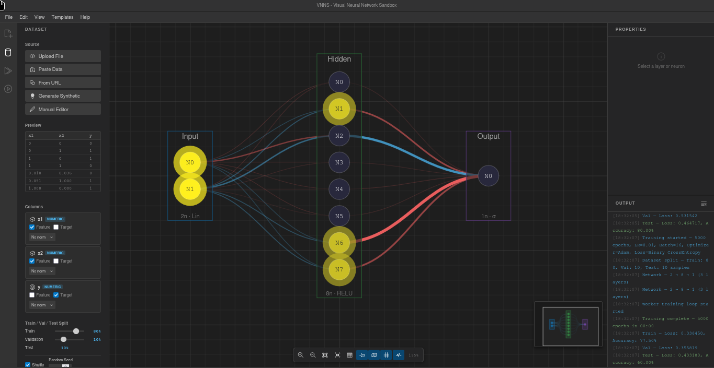

# VNNS — Visual Neural Network Sandbox

Build, visualize, and train neural networks entirely in your browser — no server, no dependencies, no setup.

<p align="center">
  
</p>

<p align="center">
  <a href="https://carlosdlw.github.io/vnns/"><strong>Try it live →</strong></a>
</p>

---

## Features

### Canvas Editor
- Drag & drop layers and neurons on an infinite canvas
- Auto-connect with 6 connection modes or connect manually
- Undo/Redo, Auto Layout, Snap to Grid
- Semantic zoom: full detail → collapsed → minimal
- Context menus, keyboard shortcuts, minimap navigation

### Network Layers
- **Dense** — fully connected layers
- **Dropout** — inverted dropout with configurable rate (0–0.9), visual overlay during training
- **Batch Normalization** — post-linear, pre-activation; training uses batch stats, inference uses running EMA

### Training
- C backend compiled to **WebAssembly** — runs entirely in a **Web Worker** (UI never freezes)
- **4 optimizers**: SGD, SGD + Momentum, Adam, RMSprop
- **9 activations**: ReLU, Sigmoid, Tanh, Softmax, LeakyReLU, ELU, GELU, Swish, Linear
- **5 loss functions**: MSE, Binary CrossEntropy, Categorical CrossEntropy, MAE, Huber
- **Early Stopping** with configurable patience and min delta
- Configurable learning rate, batch size, epochs, train/val/test split
- Real-time loss and accuracy charts with validation loss tracking

### Visualization
- Weight-colored connections (blue = positive, red = negative)
- Neuron activation heatmap
- Decision boundary plot (2D classification)
- Forward pass animation
- Tooltips on hover (weights, biases, activations)

### Datasets
- Upload CSV/JSON, paste data, or load from URL
- Synthetic generators: Moons, Circles, Spiral, Gaussian Blobs, Checkerboard, XOR, Iris, Regression, Autoencoder
- Manual dataset editor
- Per-column role assignment (feature/target) and normalization

### Templates
- Classifier (Iris) · Deep · Wide · Autoencoder · Binary (XOR) · Regression
- Dropout Regularization · Batch Normalization
- Custom (define layer sizes interactively)

### Import / Export
- Network topology as JSON
- Trained weights as JSON
- Canvas snapshot as PNG

---

## Tech Stack

| Component | Technology |
|-----------|------------|
| Frontend  | HTML5 Canvas, Vanilla JS, CSS |
| Backend   | C99 → WebAssembly (Emscripten) |
| Training  | Web Worker (off main thread) |
| Charts    | Chart.js 4.4.7 |
| Icons     | VS Code Codicons |

---

## Building the WASM Backend

Requires [Emscripten](https://emscripten.org/docs/getting_started/downloads.html):

```bash
cd backend
make clean && make
```

Outputs `build/vnns.js` and `build/vnns.wasm`.

## Running Locally

Serve the root directory with any static file server:

```bash
npx serve .
# or
python -m http.server 8000
```

Open `http://localhost:8000`.

## License

MIT
